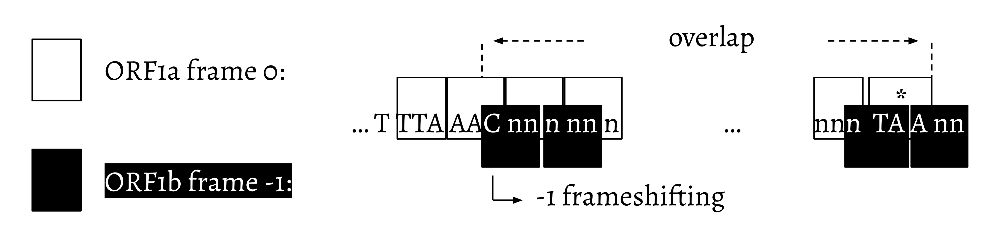
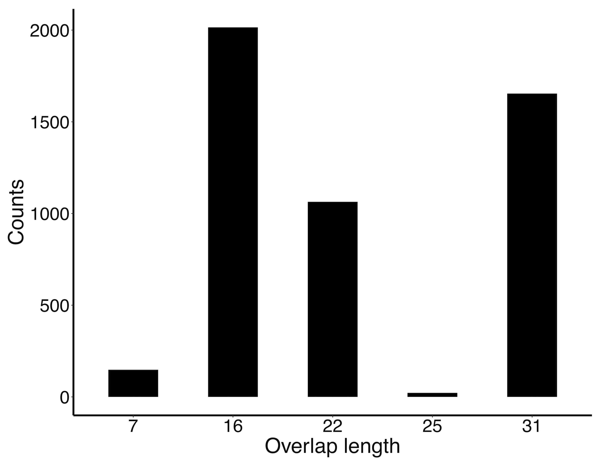
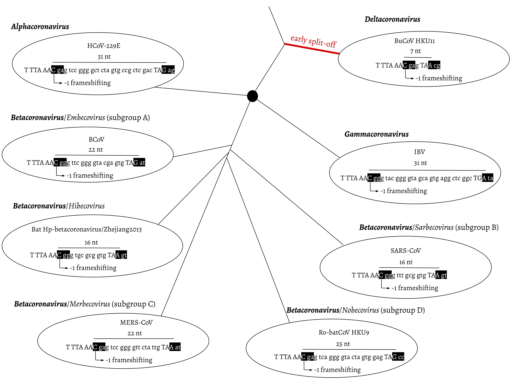
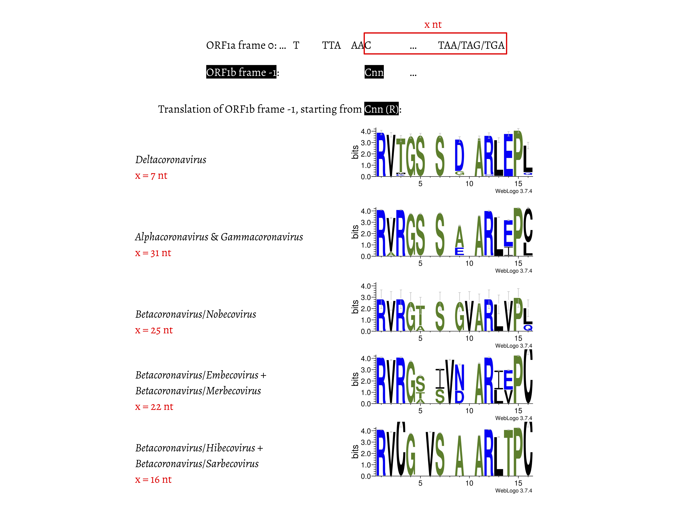

## Evolutionary dynamics of frameshift regions in coronaviruses

Han Mei and Anton Nekrutenko

Department of Biochemistry and Molecular Biology, The Pennsylvania State University

This paper has been published: 
Molecular Biology and Evolution, Volume 38, Issue 12, December 2021, Pages 5678–5684, https://doi.org/10.1093/molbev/msab265

In coronaviruses (CoV), ORF1b is translated via -1 frameshifting from the ORF1a frame 0. This process generates a overlap between these two ORFs. We have performed analysis in the overlap region between ORF1a and ORF1b in the _Coronaviridae_ family. We found that: 
- at the genus/subgenus level, the length of the overlap is group specific, 
- between different genera/subgenera, the change of the overlap nt is marked by "GTA" insertions and "TCT"-like deletions. 

We defined the overlap between ORF1a and ORF1b as the nt stretching from the "C" in the slippery site "TTTAAAC" to the last nt in ORF1a stop codon. This is shown below: 

To cover as many CoV sequences as possible, we pulled all nt entries under the [_Coronaviridae_](https://www.ncbi.nlm.nih.gov/Taxonomy/Browser/wwwtax.cgi?mode=Info&id=11118&lvl=3&lin=f&keep=1&srchmode=1&unlock) family on NCBI Taxonomy, which covers _Coronavirinae_, _Orthocoronavirinae_, and unclassified _Coronaviridae_. Under _Orthocoronavirinae_ are the commonly investigated CoV genera—_Alpha-_, _Beta-_, _Delta-_, and _Gammacoronavirus_. The request was last done on May 5, 2020, which gave us 35,152 sequences. We removed sequences: 
- with nt length shorter than 14,945 nt, 
- or containing no annotation information, 
- or containing gaps in the overlap, 

and ended up with 4,904 sequences for downstream analyses. 

### Overlap length is group specific—the (7, 16, 22, 25, 31 nt) rule 

We found that the length of the ORF1a and ORF1b overlap is group specific. All _Deltacoronavirus_ have an overlap length of 7 nt. Within _Betacoronavirus_, _Hibecovirus_ and _Sarbecovirus_ contain 16 nt in the overlap; _Embecovirus_ and _Merbecovirus_ have 22 nt; and for _Nobecovirus_, the length is 25 nt. For _Alphacoronavirus_ and _Gammacoronavirus_, they both contain 31 nt in the overlap. There are 71 unclassified CoV sequences, while each of these has its overlap length falling into the (7, 16, 22, 25, 31 nt) set. 

The distribution of the overlap length is shown in the table and the histogram below: 

| Genus/Subgenus | Overlap length (nt) | Number of sequences |
| --- | --- | --- |
| Deltacoronavirus | 7 | 148 |
| Betacoronavirus: Hibecovirus & Sarbecovirus | 16 | 2 & 2000 | 
| Betacoronavirus: Embecovirus & Merbecovirus | 22 | 420 & 613 | 
| Betacoronavirus: Nobecovirus | 25 | 14 | 
| Alphacoronavirus & Gammacoronavirus | 31 | 1209 & 426 | 
| unclassified | 16 & 22 & 25 & 31 | 71 | 

### 7-nt is the ancestral state

Phylogenetic analyses have reported _Deltacoronavirus_ as an early split-off from the _Coronavirinae_ lineage, then _Alphacoronavirus_, the four subgenera in _Betacoronavirus_, and _Gammacoronavirus_ form distinct clades. The figure below shows this evolutionary relationship by using one RefSeq record as a genus/subgenus representative. 

### Amino acid sequence alignment in the overlap

We compared the first 13–14 amino acids of ORF1b in all these 4,904 CoV sequences, grouped by the overlap length. The amino acid sequences aligned well in a position-wise way (figure below). At some positions, the amino acid sequences are highly conserved: arginine (R) is invariable at position 1, and the same is observed for glycine (G) at position 4, serine (S) at position 7, alanine-arginine-leucine (ARL) at positions 11–13, and proline (P) at position 15.

### nt alignment in the overlap reveals the footprint of "GTA" insertions and "TCT"-like deletions 

We then looked into the nt sequences encoding the amino acids mentioned above. 
- Comparing CoV with 7 and 31 nt in the overlap, the stop codon to generate a 7-nt overlap is abolished at positions 5–7, possibly through substitution event(s). This leads to an extension of ORF1a to the next stop codon at positions 38–40 in ORF1a frame 0. This extension thus results in a new overlap with 31 nt, which turns out to be that in _Alpha-_ and _Gammacoronavirus_ . 

- Comparing CoV with 31 and 25 nt in the overlap, the nt align well except leaving the footprint of a "GTA" insertion at positions 28–30. "TA" from the "GTA" together with the following "G" at position 31 makes up the stop codon, which is 6 nt ahead of the original stop codon (at positions 38–40) in CoV with 31-nt overlap. It is worth noting that in CoV with 25-nt overlap, the stop codon (at positions 38–40) originated from those with 31-nt overlap remains invariable. 

- Further comparison of CoV with 31 and 22 nt in the overlap revealed the footprint of a "GTA" insertion as well, but at positions 22–24. "TA" at positions 23–24 and the following "A" or "G" at position 25 constitute the new stop codon. In CoV with 22-nt overlap, substitutions have been observed at the original stop codon from 31-nt overlap CoV; more specifically, "C" appears at position 39. 

- Finally, we compared CoV with 31 and 16 nt in the overlap. The same "GTA" footprint was found, at positions 16–18, which is more ahead of those two "GTA" insertions during 31 → 25 nt and 31 → 22 nt. "TA" at positions 17–18 and the following "A" at position 19 form the stop codon in the 16-nt overlap CoV. In addition, the footprint of nt deletions was observed at positions 13–15. These deletions are referred as "TCT"-like, since "TCT" are the dominant nt observed at positions 13–15 in the 7-nt and 31-nt overlap CoV. At positions 38–40, the original stop codon in the 31-nt overlap CoV can barely be seen, since the nt at position 39 is invariably represented by "T". 

These comparisons are shown below: 

The evolution of CoV leaves footprints of "GTA" insertions and "TCT"-like deletions. This does not necessarily mean an event with all three nt inserted at one time, so as to the deletions. In this overlap region, we did observe single nt substitution events in CoV, i.e. PEDV CHGD-01 (JX261936.1) and PEDV KB2013-4 (KX580953.1). We also found a single nt insertion event in IBV Ind-TN92-03 (KR902510.1). Therefore, changes of the overlap length could result from alternative paths involving multiple steps. Our work tried to show the changes in the most parsimonious way. 
